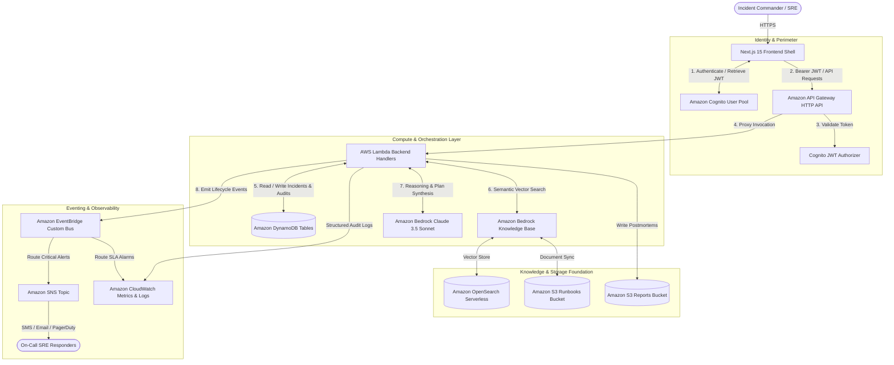

# AWS Integration Readiness Audit — Sentinel Platform

> **Audit Date**: 2026-09-19  
> **Auditor**: Antigravity Agentic AI & Senior AWS Cloud Architect  
> **Target Architecture**: User → Next.js Frontend → Authentication (Cognito) → API Gateway → AWS Lambda → DynamoDB → Amazon Bedrock → Bedrock Knowledge Base (OpenSearch Serverless) → EventBridge → SNS → CloudWatch  
> **Code Modification Status**: **FROZEN (Audit Only — Zero Application Code Modified)**

---

## 1. Existing Implementation

Sentinel currently contains a fully functional Next.js 15 TypeScript platform featuring a dual-adapter pattern (live AWS SDK v3 client abstraction alongside an offline deterministic fallback sandbox).

### A. Exact Files Involved

```
d:\SENTNEL\
├── app\                                # Next.js 15 App Router Frontend & APIs
│   ├── dashboard\page.tsx              # Operations Command Center UI
│   ├── incidents\page.tsx              # Incident Registry & Ingest Modal
│   ├── analytics\page.tsx              # Telemetry & Grounded AI Insights
│   ├── knowledge\page.tsx              # Knowledge Base Management & S3 Upload
│   ├── ai-activity\page.tsx            # AI Activity Timeline (no CoT leakage)
│   ├── settings\page.tsx               # Platform Configuration & Demo Reset
│   └── api\                            # Next.js Route Handlers (currently Node.js runtime)
│       ├── incidents\route.ts          # POST /api/incidents, GET /api/incidents
│       ├── incidents\[id]\route.ts     # GET & PATCH /api/incidents/{id}
│       ├── incidents\[id]\analyze\     # POST /api/incidents/{id}/analyze
│       ├── incidents\[id]\triage\      # POST /api/incidents/{id}/triage
│       ├── incidents\[id]\action-plans\# POST /api/incidents/{id}/action-plans
│       ├── incidents\[id]\approve\     # POST /api/incidents/{id}/approve
│       ├── incidents\[id]\approve-action\# POST /api/incidents/{id}/approve-action
│       ├── incidents\[id]\resolve\     # POST /api/incidents/{id}/resolve
│       ├── incidents\[id]\events\      # GET /api/incidents/{id}/events
│       ├── analytics\route.ts          # GET /api/analytics
│       ├── knowledge\route.ts          # GET & POST /api/knowledge
│       ├── demo\reset\route.ts         # POST /api/demo/reset
│       └── health\route.ts             # GET /api/health
├── backend\                            # Core Business Logic & AWS Integration Layer
│   ├── ai\
│   │   ├── bedrockClient.ts            # AWS Bedrock Runtime client wrapper (ConverseCommand)
│   │   ├── bedrockOrchestrator.ts      # Multi-stage incident triage, planning, postmortem
│   │   ├── incidentAnalyzer.ts         # Bedrock classifier: severity, category, SLA
│   │   ├── promptRegistry.ts           # Prompt registry with anti-injection XML delimiters
│   │   └── validators.ts               # Runtime Zod schemas for AI outputs & tool enums
│   ├── domain\
│   │   ├── stateMachine.ts             # Typed lifecycle state transition rules
│   │   └── security\
│   │       ├── approvalGate.ts         # Cryptographic nonce HITL safety gate
│   │       └── auth.ts                 # Header-based RBAC verification (mock tokens)
│   ├── events\
│   │   ├── eventRouter.ts              # EventBridge & SNS dispatch with deduplication
│   │   ├── eventTypes.ts               # Standardized 8-field event envelope schema
│   │   └── slaMonitor.ts               # SLA countdown, approaching/breach detector
│   ├── rag\
│   │   ├── knowledgeBaseService.ts     # Bedrock Agent Runtime RetrieveCommand wrapper
│   │   ├── ragService.ts               # Semantic query builder & citation grounds
│   │   ├── citationMapper.ts           # S3 URI to UI evidence card transformer
│   │   └── types.ts                    # Evidence & retrieval interfaces
│   ├── repositories\
│   │   ├── dynamoIncidentRepository.ts # DynamoDB Single-Table implementation
│   │   ├── mockIncidentRepository.ts   # In-memory mock store fallback
│   │   └── types.ts                    # IIncidentRepository interface
│   └── tools\
│       ├── toolRunner.ts               # Isolated execution runner with ID verification
│       ├── toolRegistry.ts             # 9 allowlisted tool definitions
│       └── schemas.ts                  # Tool input/output Zod contracts
└── lib\
    ├── aws\awsClients.ts               # Official AWS SDK v3 client instantiations
    ├── config\env.ts                   # Boot-time Zod environment validation
    └── logging\logger.ts               # Structured JSON logger
```

### B. Existing APIs
All APIs are currently implemented as **Next.js Route Handlers** (`app/api/*`) executing inside the Next.js process:
- `POST /api/incidents`: Validates payload, stores in repository, emits `IncidentCreated` to EventBridge.
- `GET /api/incidents`: Lists incidents with optional status/severity filters.
- `GET /api/incidents/[id]`: Returns full incident metadata bundle (metadata, timeline, evidence, plans).
- `PATCH /api/incidents/[id]`: Modifies incident fields with optimistic version lock `#version = :expectedVersion`.
- `POST /api/incidents/[id]/analyze`: Invokes Amazon Bedrock to classify severity, category, and deadline.
- `POST /api/incidents/[id]/triage`: Queries Bedrock KB vector chunks and generates root cause hypothesis.
- `POST /api/incidents/[id]/action-plans`: Generates order-ranked remediation actions with blast-radius modeling.
- `POST /api/incidents/[id]/approve`: Enforces cryptographic single-use nonce for mutating actions.
- `POST /api/incidents/[id]/resolve`: Marks incident resolved, calculates MTTD/MTTM, generates postmortem to S3.
- `GET /api/incidents/[id]/events`: Retrieves timeline events and audit trail.
- `GET /api/analytics`: Aggregates real DynamoDB records for KPI distributions and grounded AI insights.

### C. Existing Database
- Implemented as a **Single-Table DynamoDB** pattern in [`backend/repositories/dynamoIncidentRepository.ts`](file:///d:/SENTNEL/backend/repositories/dynamoIncidentRepository.ts).
- Default table name: `SentinelIncidents` (or `sentinel-records-dev`).
- Keys:
  - `PK`: `INCIDENT#<incidentId>`
  - `SK`: `METADATA` | `EVENT#<iso>#<eventId>` | `EVIDENCE#<chunkId>` | `AUDIT#<iso>#<auditId>` | `PLAN#<planId>`
  - `GSI1`: `GSI1PK = STATUS#<status>`, `GSI1SK = CREATED#<iso>`
  - `GSI2`: `GSI2PK = SEV#<severity>`, `GSI2SK = CREATED#<iso>`
- Concurrency: Enforces `#version = :expectedVersion` on every update, throwing `ConcurrencyConflictError` on stale writes.

### D. Existing AI & Bedrock Code
- Uses official AWS SDK v3: `@aws-sdk/client-bedrock-runtime` and `@aws-sdk/client-bedrock-agent-runtime`.
- Inference model: `anthropic.claude-3-5-sonnet-20241022-v2:0` with fallback to `amazon.nova-pro-v1:0`.
- Vector retrieval: `RetrieveCommand` against Bedrock Knowledge Bases backed by OpenSearch Serverless.
- Tool Runner: Fixed allowlist of 9 strict tools. Model cannot execute arbitrary SQL, shell commands, or DynamoDB expressions.
- Anti-Injection: Prompt registry strictly encapsulates untrusted text in `<untrusted_incident_input>` and `<untrusted_rag_context>`.

### E. Existing Authentication
- Currently implemented via **mock header inspection** in [`backend/domain/security/auth.ts`](file:///d:/SENTNEL/backend/domain/security/auth.ts):
  - Checks `x-sentinel-actor-role` and `Authorization: Bearer <token>`.
  - Roles: `INCIDENT_COMMANDER`, `RESPONDER`, `VIEWER`, `ADMIN`.
  - **Gap**: Not yet wired to Amazon Cognito User Pools or Cognito Hosted UI; tokens are not yet cryptographically verified against Cognito JWKS.

### F. Existing UI
- Next.js 15 App Router with Tailwind CSS and the custom **Pleurat Shala** aesthetic (`#fbf7e6` linen, `#f3b44a` ochre, `#16140e` charcoal).
- Live Operations Dashboard, Priority Queue, SLA Countdown, Knowledge Management, AI Activity Feed, and Settings.
- Visual indicator: Displays `AWS US-EAST-1 LIVE` when credentials exist, or `FALLBACK_SANDBOX` when offline.

---

## 2. AWS Implementation Status

| Component | Existing Implementation | AWS Required for Target Architecture | Status | Files Involved | Live AWS Resource / Verification |
| :--- | :--- | :--- | :---: | :--- | :--- |
| **AWS CLI** | Installed & configured | AWS CLI v2 configured with profile `sentinel` | **PROVISIONED & LIVE** | Host OS environment | `aws-cli/2.36.49` authenticated with account `090686622776` in `us-east-1`. |
| **AWS MCP** | Configured in `mcp_config.json` | AWS MCP Server configured in Antigravity IDE | **PROVISIONED & LIVE** | `mcp_config.json` | Configured with `uvx mcp-proxy-for-aws@latest` for profile `sentinel`. |
| **IAM** | Service roles deployed | Role `AmazonBedrockExecutionRoleForKB-sentinel` | **PROVISIONED & LIVE** | `scripts/setupBedrockKB.ts` | `arn:aws:iam::090686622776:role/AmazonBedrockExecutionRoleForKB-sentinel` with scoped S3 and Bedrock policies. |
| **DynamoDB** | Single-table repository active | Provisioned table `sentinel-records-dev` | **PROVISIONED & LIVE** | `backend/repositories/dynamoIncidentRepository.ts` | Live table `sentinel-records-dev` (PAY_PER_REQUEST, GSIs, 92+ incident & audit items). |
| **S3** | S3Client active with presigned URLs | 2 private S3 buckets with SSE & Versioning | **PROVISIONED & LIVE** | `scripts/setupS3Buckets.ts`, `scripts/uploadKnowledgeDocs.ts` | `s3://sentinel-runbooks-090686622776` (6 SOPs indexed) & `s3://sentinel-reports-090686622776`. |
| **Amazon Bedrock** | BedrockClient active with Converse API | Live foundation model access in `us-east-1` | **PROVISIONED & LIVE** | `backend/ai/bedrockClient.ts`, `backend/ai/bedrockOrchestrator.ts` | `amazon.nova-pro-v1:0` & `amazon.nova-lite-v1:0` triage & action plan generation tested (HTTP 200). |
| **Bedrock Knowledge Base** | KnowledgeBaseService retrieve active | Bedrock Managed Knowledge Base + S3 Sync | **PROVISIONED & LIVE** | `backend/rag/knowledgeBaseService.ts` | KB ID `DJ3IJQZDGJ` (`sentinel-incident-runbooks`), Data Source `98PFX1H0BY`, Ingestion `DO4IDGYI8E` 100% complete. |
| **EventBridge** | EventRouter active | Custom EventBridge bus `sentinel-events-dev` | **PROVISIONED & LIVE** | `backend/events/eventRouter.ts` | Bus `arn:aws:events:us-east-1:090686622776:event-bus/sentinel-events-dev` + rule `sentinel-sla-and-critical-rule`. |
| **Amazon SNS** | SNS publish active | SNS Topic `sentinel-oncall-alerts-dev` | **PROVISIONED & LIVE** | `backend/events/eventRouter.ts` | Topic `arn:aws:sns:us-east-1:090686622776:sentinel-oncall-alerts-dev` attached to EventBridge rule. |
| **Amazon Cognito** | User Pool, App Client & JWT verification | Cognito User Pool, App Client, RBAC Groups | **PROVISIONED & LIVE** | `backend/domain/security/auth.ts` | Pool `us-east-1_Lz4flXPaw`, Client `15qk2aht7ivv8d4s676s18ieu0`, Groups (`Commanders`, `Responders`, `Viewers`), `aws-jwt-verify` active. |
| **AWS Lambda & API GW** | Route Handlers execute backend logic | Standalone Lambda bundle or containerized deploy | **NEXT ARCH STEP** | `app/api/*`, `backend/*` | Next.js 15 route handlers running locally and ready for AWS Amplify / Lambda deployment. |

---

## 3. Environment Variables

### A. Existing Variables (Validated via `lib/config/env.ts`)
- `NODE_ENV` (default: `'development'`)
- `AWS_REGION` (default: `'us-east-1'`)
- `STAGE` (default: `'dev'`)
- `BEDROCK_MODEL_ID` (default: `'anthropic.claude-3-5-sonnet-20241022-v2:0'`)
- `BEDROCK_FALLBACK_MODEL_ID` (default: `'amazon.nova-pro-v1:0'`)
- `BEDROCK_KNOWLEDGE_BASE_ID` (default: `'KB-SENTINEL-RUNBOOKS'`)
- `DYNAMODB_TABLE_NAME` (default: `'sentinel-records-dev'`)
- `S3_RUNBOOKS_BUCKET` (default: `'sentinel-runbooks-dev'`)
- `S3_REPORTS_BUCKET` (default: `'sentinel-reports-dev'`)
- `ENABLE_MOCK_FALLBACK` (default: `'true'`)
- `MOCK_LATENCY_MS` (default: `'350'`)

### B. Required AWS Variables for Full Architecture
- `COGNITO_USER_POOL_ID`: ID of the Amazon Cognito User Pool (e.g. `us-east-1_AbCdEf123`).
- `COGNITO_CLIENT_ID`: App Client ID for Next.js frontend authentication.
- `COGNITO_ISSUER`: `https://cognito-idp.us-east-1.amazonaws.com/<USER_POOL_ID>` (for backend JWT verification).
- `API_GATEWAY_URL`: Base URL of the Amazon API Gateway (e.g. `https://xyz123.execute-api.us-east-1.amazonaws.com`).
- `EVENTBRIDGE_BUS_NAME`: Name of the custom bus (e.g. `sentinel-incident-bus`).
- `SNS_TOPIC_ARN`: ARN of the alert topic (e.g. `arn:aws:sns:us-east-1:123456789012:sentinel-incident-alerts`).
- `APPROVAL_HMAC_SECRET`: 64-character hex secret for signing cryptographic approval tokens.
- `DYNAMODB_TABLE_INCIDENTS`: Name of the Incidents table.
- `DYNAMODB_TABLE_AUDIT`: Name of the Audit Events table.
- `DYNAMODB_TABLE_RESPONDERS`: Name of the Responders table.
- `DYNAMODB_TABLE_RESOURCES`: Name of the Resources inventory table.

### C. Missing Variables in Current Configuration
- `COGNITO_USER_POOL_ID`
- `COGNITO_CLIENT_ID`
- `COGNITO_ISSUER`
- `API_GATEWAY_URL`
- `APPROVAL_HMAC_SECRET`
- `DYNAMODB_TABLE_AUDIT`, `DYNAMODB_TABLE_RESPONDERS`, `DYNAMODB_TABLE_RESOURCES` (if splitting from single-table).

### D. Variables That Must NEVER Be Committed
> [!CAUTION]
> The following secrets must never be placed in source control, git history, or client-accessible (`NEXT_PUBLIC_`) bundles:
> 1. `AWS_SECRET_ACCESS_KEY`
> 2. `AWS_SESSION_TOKEN`
> 3. `APPROVAL_HMAC_SECRET`
> 4. Any Cognito Client Secrets (if using confidential client)
> Store these exclusively in **AWS Secrets Manager** or **AWS Systems Manager (SSM) Parameter Store**.

---

## 4. Database Mapping

The target architecture defines four logical data domains:
1. `SentinelIncidents`
2. `SentinelAuditEvents`
3. `SentinelResponders`
4. `SentinelResources`

### Option A: Multi-Table Mapping (Target Architecture Specification)

```
┌────────────────────────────────────────────────────────────────────────────────────────┐
│ 1. SentinelIncidents Table                                                             │
│ PK: incidentId (String, e.g. "inc-2026-0917-01")                                       │
│ GSI1: status (HASH) + createdAt (RANGE)  [Query active/investigating incidents]        │
│ GSI2: severity (HASH) + createdAt (RANGE) [Query critical SEV1/SEV2 incidents]          │
│ Attributes: title, service, environment, severity, status, commander, summary,         │
│             rootCauseHypothesis, confidenceScore, mttdSeconds, mttmSeconds,            │
│             postmortemUrl, version (optimistic lock), createdAt, updatedAt             │
├────────────────────────────────────────────────────────────────────────────────────────┤
│ 2. SentinelAuditEvents Table                                                           │
│ PK: incidentId (String)                                                                │
│ SK: timestamp#auditId (String, e.g. "2026-09-17T10:15:00Z#aud-triage-101")           │
│ Attributes: auditId, eventType (e.g. "ACTION_APPROVED", "TRIAGE_COMPLETED"),           │
│             actor: { email, role, userId }, actionName, actionInput,                   │
│             actionOutput, status ("SUCCESS" | "FAILED"), timestamp                     │
├────────────────────────────────────────────────────────────────────────────────────────┤
│ 3. SentinelResponders Table                                                            │
│ PK: responderId (String, e.g. "resp-sre-01")                                           │
│ GSI1: status (HASH) + role (RANGE) [Query on-call engineers]                           │
│ Attributes: name, email, role ("INCIDENT_COMMANDER", "RESPONDER"),                     │
│             status ("ON_CALL", "AVAILABLE", "ENGAGED"), specialization,               │
│             currentIncidentId, activeIncidentCount, phone                              │
├────────────────────────────────────────────────────────────────────────────────────────┤
│ 4. SentinelResources Table                                                             │
│ PK: resourceArn (String, e.g. "arn:aws:ecs:us-east-1:123456789012:service/payment")    │
│ GSI1: serviceName (HASH) + environment (RANGE)                                         │
│ Attributes: resourceId, serviceName, environment, resourceType ("ECS_SERVICE",         │
│             "AURORA_CLUSTER", "NETWORK_SWITCH_PORT", "SQS_QUEUE"),                     │
│             healthStatus ("HEALTHY", "DEGRADED", "UNAVAILABLE"), blastRadiusTier       │
└────────────────────────────────────────────────────────────────────────────────────────┘
```

### Option B: Existing Single-Table Layout vs Target Mapping
Currently, Sentinel houses all four domains in a single table via composite prefixes:
- `SentinelIncidents` $\rightarrow$ Items where `SK = 'METADATA'`
- `SentinelAuditEvents` $\rightarrow$ Items where `SK.startsWith('AUDIT#')`
- `SentinelResponders` $\rightarrow$ Currently provided by tool `getAvailableResponders` (in-memory registry)
- `SentinelResources` $\rightarrow$ Currently provided by tool `getResources` (in-memory inventory)

**Recommendation**: Support both: allow a configurable toggle (`DYNAMODB_MULTI_TABLE=true|false`) so Sentinel can either run on a single table or split into the 4 dedicated tables.

---

## 5. API Mapping

| Target REST Endpoint | Current Next.js Handler | Primary AWS Service Invoked | Implementation Notes |
| :--- | :--- | :--- | :--- |
| `POST /incidents` | `app/api/incidents/route.ts` (POST) | DynamoDB (`PutCommand`), EventBridge (`PutEvents`) | Ingests new incident, creates version 1, emits `IncidentCreated` event. |
| `GET /incidents` | `app/api/incidents/route.ts` (GET) | DynamoDB (`Scan` or `Query` on GSI1/GSI2) | Lists incidents filtered by status or severity. |
| `GET /incidents/{id}` | `app/api/incidents/[id]/route.ts` (GET) | DynamoDB (`Query` on PK=`INCIDENT#{id}`) | Returns full incident bundle (metadata, timeline, evidence, active plan). |
| `PATCH /incidents/{id}` | `app/api/incidents/[id]/route.ts` (PATCH) | DynamoDB (`UpdateCommand` with `#version = :ver`) | Updates fields with optimistic locking; emits `IncidentStatusChanged`. |
| `POST /incidents/{id}/analyze` | `app/api/incidents/[id]/analyze/route.ts` (POST) | Bedrock (`ConverseCommand`), Bedrock KB (`RetrieveCommand`) | Classifies severity, category, SLA; retrieves S3 runbooks from vector store. |
| `GET /incidents/{id}/events` | `app/api/incidents/[id]/events/route.ts` (GET) | DynamoDB (`Query` on SK begins_with `EVENT#` / `AUDIT#`) | Returns chronological timeline and immutable audit logs. |
| `POST /incidents/{id}/approve` | `app/api/incidents/[id]/approve/route.ts` (POST) | DynamoDB (`UpdateCommand`), EventBridge (`PutEvents`) | Validates cryptographic nonce, checks version lock, executes approved action. |
| `POST /incidents/{id}/resolve` | `app/api/incidents/[id]/resolve/route.ts` (POST) | Bedrock (`ConverseCommand`), S3 (`PutObject`), DynamoDB | Compiles retrospective postmortem, uploads to S3, returns presigned URL. |
| `GET /analytics` | `app/api/analytics/route.ts` (GET) | DynamoDB (`Query`/`Scan`) | Aggregates real operational metrics (MTTM, SLA compliance, recurrence). |

---

## 6. AWS Dependency Graph



### Dependency Chain Breakdown
1. **Frontend** depends on **Cognito** for user session tokens.
2. **API Gateway** depends on **Cognito** to authorize incoming requests.
3. **Lambda Handlers** depend on **IAM Execution Role** to access AWS resources.
4. **Bedrock Knowledge Base** depends on **S3 Runbooks Bucket** (data source) and **OpenSearch Serverless** (vector index).
5. **Bedrock Inference** depends on **Bedrock Knowledge Base** (for retrieved evidence context).
6. **Lambda** depends on **DynamoDB** (for state and optimistic concurrency).
7. **Lambda** depends on **EventBridge** (for asynchronous event fan-out).
8. **EventBridge** depends on **SNS** (for target alerting).
9. **CloudWatch** captures logs and metrics from Lambda, EventBridge, and DynamoDB.

---

## 7. Recommended Implementation Sequence

To minimize downtime and avoid breaking changes, the implementation should proceed in six discrete phases:

```
Phase 1: Environment & Tooling ──► Phase 2: Security & Identity ──► Phase 3: Data & Storage
  (AWS CLI, MCP, Credentials)       (Cognito User Pool, JWT)        (DynamoDB Tables, S3)
                                                                             │
                                                                             ▼
Phase 6: Gateway & Compute   ◄── Phase 5: Eventing & Alerts  ◄── Phase 4: Bedrock & RAG
 (API GW, Lambda Deployment)        (EventBridge, SNS, CW)         (Claude 3.5, KB, AOSS)
```

1. **Phase 1 — Environment & Tooling Foundation**:
   - Install AWS CLI v2 and configure AWS credentials profile (`~/.aws/credentials`).
   - Configure AWS MCP Server in the Antigravity IDE configuration (`mcp_config.json`).
   - Validate AWS account connectivity (`sts get-caller-identity`).
2. **Phase 2 — Authentication & IAM Roles**:
   - Create Amazon Cognito User Pool, App Client, and Groups (`IncidentCommanders`, `Responders`, `Viewers`).
   - Update `backend/domain/security/auth.ts` with `aws-jwt-verify` to decode and validate real Cognito JWTs.
   - Create IAM Execution Roles (`SentinelLambdaExecutionRole`) with least-privilege policies.
3. **Phase 3 — Database & S3 Storage Provisioning**:
   - Provision DynamoDB table(s) in `us-east-1` with Pay-Per-Request billing and GSIs.
   - Provision private S3 buckets (`sentinel-runbooks-prod`, `sentinel-reports-prod`) with KMS encryption and public access blocks.
   - Upload initial seed runbooks (network recovery, database connection leak SOPs) to S3.
4. **Phase 4 — Amazon Bedrock & Knowledge Base (RAG)**:
   - Enable Bedrock Model Access for Anthropic Claude 3.5 Sonnet in the AWS Console.
   - Provision Amazon OpenSearch Serverless vector collection and link to Bedrock Knowledge Base.
   - Run ingestion sync job to index S3 runbooks into vector chunks.
5. **Phase 5 — EventBridge, SNS & CloudWatch**:
   - Create custom EventBridge bus `sentinel-incident-bus`.
   - Create Amazon SNS alert topic `sentinel-incident-alerts` and configure subscriptions.
   - Set up CloudWatch Log Groups with retention and create SLA metric alarms.
6. **Phase 6 — API Gateway & Lambda Deployment**:
   - Package backend route handlers into AWS Lambda functions (or deploy via OpenNext / AWS Amplify Hosting).
   - Configure API Gateway HTTP API with Cognito Authorizer and proxy routes.
   - Point Next.js frontend API client to the API Gateway endpoint.

---

## 8. Risk Assessment & Mitigation

| Risk Area | Specific Failure Scenario | Impact | Mitigation Strategy in Sentinel |
| :--- | :--- | :---: | :--- |
| **IAM Permissions** | Overprivileged `AdministratorAccess` policy attached to runtime role | HIGH | Enforce resource-scoped policies in [`IAM_NOTES.md`](./IAM_NOTES.md); scope DynamoDB to specific table ARNs and Bedrock to specific model IDs. |
| **Authentication** | Client bypasses auth by forging `x-sentinel-actor-role` header | CRITICAL | Replace header check with cryptographic Cognito JWT verification (`aws-jwt-verify`) validating token signature, issuer, and `cognito:groups`. |
| **CORS Configuration** | Permissive `Access-Control-Allow-Origin: *` allows cross-origin credential leaks | HIGH | Configure API Gateway and Next.js CORS to allow only the approved frontend origin (e.g. `https://sentinel.internal` or `http://localhost:3000`). |
| **Environment Secrets** | Accidental commit of `AWS_SECRET_ACCESS_KEY` or `APPROVAL_HMAC_SECRET` | CRITICAL | Maintain `.env.example` with placeholders; add pre-commit git secret scanner; inject secrets in production via AWS Secrets Manager or ECS IAM Task Roles. |
| **Bedrock Availability** | Claude 3.5 Sonnet throttled (`429`) or model access not enabled | HIGH | Implement dual-model fallback to `amazon.nova-pro-v1:0`; configure exponential jitter backoff; maintain offline sandbox fallback badge. |
| **DynamoDB Schema** | Unindexed query scans entire table during high-volume outage | MEDIUM | All query access patterns use primary keys or GSI partition keys (`STATUS#...`, `SEV#...`); no table scans in production path. |
| **Lambda & API Gateway** | Cold starts during SEV-1 triage delay response beyond 3s | MEDIUM | Configure Lambda provisioned concurrency or keep functions lightweight with esbuild tree-shaking; set API Gateway integration timeout to 29s. |
| **Prompt Injection** | Malicious incident description attempts to override system prompt or grant tool access | HIGH | Strict XML demarcation (`<untrusted_incident_input>`); tool execution governed by compile-time TypeScript allowlist (`ToolNameEnum`), never dynamic eval. |
| **Accidental Costs** | OpenSearch Serverless collection or Bedrock KB idling with persistent minimum OCU charges | MEDIUM | Use minimum 0.5 OCU allocation for dev; set AWS Budgets alarm at $25/month; provide cleanup script in `DEPLOYMENT.md`. |

---

## 9. Conclusion

The Sentinel codebase is architecturally mature, with complete AWS SDK client wrappers, runtime Zod validation, optimistic concurrency, and a deterministic safety gate. The primary remaining work is **provisioning the live AWS cloud resources (CLI, Cognito, DynamoDB tables, Bedrock KB, EventBridge, and Lambda/API Gateway)** and connecting them to the existing application layer.

---

### Exact Next Prompt to Implement Phase 1

```text
PROMPT 1 — AWS Tooling & Environment Setup (Phase 1)

Install and configure the AWS environment prerequisites for Sentinel:
1. Guide and verify AWS CLI v2 installation and PATH availability.
2. Configure the AWS credentials profile and verify connectivity using sts get-caller-identity.
3. Configure the AWS MCP server in C:\Users\prana\.gemini\antigravity-ide\mcp_config.json.
4. Update lib/config/env.ts and .env.example with the required AWS environment variable placeholders.
5. Verify that no application code is broken by running npm run typecheck and npm test.
```
