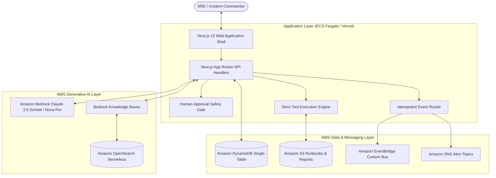

# SENTINEL: Autonomous Incident Intelligence & Human-in-the-Loop Cloud Remediation Platform

> **AWS Generative AI Hackathon Submission**  
> *Transforming critical cloud outages into evidence-grounded, human-approved autonomous response workflows powered by Amazon Bedrock, DynamoDB, OpenSearch Serverless, EventBridge, SNS, and S3.*  
>  
> 🌐 **Live AWS Amplify Deployment**: [https://main.d3puckfek6iecn.amplifyapp.com](https://main.d3puckfek6iecn.amplifyapp.com)  
> 🔑 **Operator Access (Cognito)**: `admin@sentinel.ai` / `Sentinel2026!` (Admin) • `commander@sentinel.internal` / `Sentinel2026!` (Commander)

[](https://nextjs.org/)
[](https://www.typescriptlang.org/)
[](https://aws.amazon.com/sdk-for-javascript/)
[](https://main.d3puckfek6iecn.amplifyapp.com)
[](https://opensource.org/licenses/Apache-2.0)
[](./tests/runAllTests.ts)

---

## 1. Problem

During major cloud outages (SEV-1/SEV-2), Site Reliability Engineers (SREs) and incident commanders face three critical bottlenecks:
1. **Alert Fatigue & Sprawl**: Hundreds of alarms fire simultaneously across CloudWatch, fragmented metrics, and distributed microservices.
2. **Tribal Knowledge & Stale Runbooks**: Runbooks are scattered across Confluence, stale markdown files, and disparate wikis, leading to prolonged Mean Time to Mitigate (MTTM).
3. **The AI Safety Paradox**: Pure generative AI models hallucinate infrastructure resource IDs or command parameters, creating catastrophic blast-radius risk if granted autonomous execution privileges.

---

## 2. Users

- **Site Reliability Engineers (SREs)**: Seek instant telemetry correlation, automated log querying, and suggested mitigation runbooks during high-stress outages.
- **Incident Commanders**: Require real-time situational awareness, timeline event tracking, SLA countdown monitoring, and formal sign-off authority for mutative remediation steps.
- **Platform & DevOps Teams**: Rely on automated postmortem retrospective generation and preventive Jira/Linear tracking tickets to eliminate recurring failure modes.
- **Security & Compliance Auditors**: Demand cryptographic, immutable audit logs (`AuditEvent`) verifying who approved which action, with what evidence, at what exact timestamp.

---

## 3. Solution

**SENTINEL** is an enterprise-grade incident command system built on a non-negotiable safety principle:
> **AI recommends. AI prepares. Human approves. Application code executes.**

- **Autonomous Telemetry Correlation**: Ingests incident alerts and queries CloudWatch Insights.
- **Evidence-Grounded RAG**: Retrieves verified Standard Operating Procedures (SOPs) from Amazon Bedrock Knowledge Bases backed by OpenSearch Serverless.
- **Deterministic Blast-Radius Evaluation**: Synthesizes multi-step remediation action plans with explicit blast-radius boundaries and rollback strategies.
- **Cryptographic Human-in-the-Loop (HITL) Gate**: Enforces single-use nonce authorization, incident version tie-in, and role validation before any mutating tool can execute.
- **Zero Hallucination Guarantee**: All tool names and parameters are validated against strict compile-time TypeScript allowlists and runtime Zod schemas.

---

## 4. Workflow

Sentinel coordinates an 8-stage deterministic operational pipeline:

```
[ Understand ] ──► [ Retrieve ] ──► [ Check ] ──► [ Plan ] ──► [ Approval ] ──► [ Execute ] ──► [ Audit ] ──► [ Report ]
     │                   │              │            │               │               │             │              │
 CloudWatch         Bedrock KB     Verify IDs   Synthesize      Cryptographic    Allowlisted   DynamoDB &    S3 Markdown
   Alerts         Vector Chunks   in Registry   Action Plan      HMAC Nonce      Tool Runner   EventBridge   Postmortem
```

1. **Understand**: Ingests the incident title, service metadata, and CloudWatch alarm telemetry.
2. **Retrieve**: Executes vector search across S3-backed runbooks via Amazon Bedrock Knowledge Bases.
3. **Check**: Validates cited evidence chunks and ensures no nonexistent infrastructure identifiers are introduced.
4. **Plan**: Formulates a structured, order-ranked remediation plan with individual risk levels.
5. **Approval**: Generates a single-use cryptographic token requiring Incident Commander sign-off.
6. **Execute**: Application code runs the allowlisted tool (e.g. `rollback_ecs_task_definition`, `restart_ecs_service`).
7. **Audit**: Emits structured EventBridge events, SNS alerts, and immutable DynamoDB audit records.
8. **Report**: Synthesizes a blameless postmortem report and exports it to Amazon S3 with presigned URLs.

---

## 5. Architecture



---

## 6. AWS Services Employed

| AWS Service | Production Purpose | Implementation Detail |
| :--- | :--- | :--- |
| **Amazon Bedrock** | Core Reasoning & Analysis | Uses `anthropic.claude-3-5-sonnet-20241022-v2:0` for root cause formulation, blast radius risk analysis, and postmortem generation. |
| **Bedrock Knowledge Bases** | Evidence Retrieval (RAG) | Vector search powered by **Amazon OpenSearch Serverless** indexing markdown SOPs, historical incident postmortems, and compliance policies in S3. |
| **Amazon DynamoDB** | Single-Table Database | Stores incidents, timeline events, evidence chunks, action plans, and immutable audit trails with sub-10ms latency and optimistic concurrency (`#version`). |
| **Amazon S3** | Source-of-Truth Document Store | Houses engineering runbooks (`s3://sentinel-runbooks-prod/`) and generated retrospective reports (`s3://sentinel-reports-prod/`) with presigned URLs. |
| **Amazon EventBridge** | Event-Driven Incident Bus | Custom event bus (`sentinel-incident-bus`) routing incident lifecycle events and SLA alerts with duplicate suppression. |
| **Amazon SNS** | Real-Time Incident Alerting | Pager alerting topic (`sentinel-incident-alerts`) dispatching SMS/email notifications on critical severity breaches. |
| **Amazon CloudWatch** | Observability & Audit Traces | Ingests application alarms and structural logs via AWS SDK CloudWatch client. |

---

## 7. AI, RAG & Agent Design

### Strict Tool Allowlist
Sentinel executes tools through an isolated, allowlisted runner ([`backend/tools/toolRunner.ts`](file:///d:/SENTNEL/backend/tools/toolRunner.ts)). The model can never execute arbitrary code, shell commands, raw SQL, or ad-hoc DynamoDB expressions.

Available tools:
1. `searchHistoricalIncidents`: Vector lookup of prior retrospectives.
2. `searchOperationalKnowledge`: SOP retrieval from Bedrock Knowledge Base.
3. `getAvailableResponders`: Real-time on-call engineer lookup.
4. `getResources`: AWS infrastructure identifier and ARN lookup.
5. `createActionPlan`: Multi-step remediation plan synthesis.
6. `assignResponder`: Incident assignment update.
7. `updateIncident`: Safe incident lifecycle state advancement with optimistic lock.
8. `sendIncidentNotification`: EventBridge and SNS notification dispatch.
9. `generateResolutionReport`: Markdown postmortem publishing to S3.

### Anti-Prompt Injection Hardening
All untrusted user inputs and retrieved RAG context are encapsulated in strict XML delimiters (`<untrusted_incident_input>` and `<untrusted_rag_context>`) with prompt registry directives explicitly instructing the model to treat all external text as untrusted data.

---

## 8. Security & Compliance

- **Role-Based Access Control (RBAC)**: All mutating endpoints enforce `INCIDENT_COMMANDER` or `ADMIN` roles via `x-sentinel-actor-role`.
- **Replay Protection**: Cryptographic single-use nonce verification table prevents replay of approved actions.
- **Stale Approval Detection**: Approvals are bound to `incidentId` and `incidentVersion`. If the incident state advances, the approval is rejected with `409 Conflict`.
- **Zero Secrets Committed**: Plaintext credentials are strictly excluded. Uses IAM Task Roles and environment variable schemas via Zod.
- **Security Documentation**:
  - [`SECURITY.md`](./SECURITY.md): Comprehensive AWS security audit and IAM least-privilege architecture.
  - [`THREAT_MODEL.md`](./THREAT_MODEL.md): STRIDE and DREAD threat models covering all 9 threat vectors.

---

## 9. Run Locally

### Prerequisites
- Node.js 18.x or 20.x LTS
- npm 9+ or pnpm 8+

### Setup
```bash
# 1. Clone repository
git clone https://github.com/pranavtdhote/sentinel.git
cd sentinel

# 2. Install dependencies
npm install

# 3. Configure local environment
cp .env.example .env.local

# 4. Run automated test suite (88+ assertions)
npm test

# 5. Verify TypeScript and ESLint
npm run typecheck
npm run lint

# 6. Start development server
npm run dev
```

Open [http://localhost:3000](http://localhost:3000) in your browser.

> **Offline Sandbox**: If live AWS credentials are not present, Sentinel engages the dual-adapter sandbox mode, prominently marking the UI with the `FALLBACK_SANDBOX` badge while retaining 100% full-fidelity operational workflows.

---

## 10. Deploy to AWS

Refer to [`DEPLOYMENT.md`](./DEPLOYMENT.md) for complete step-by-step production deployment instructions, including:
- Amazon ECS Fargate Docker container deployment.
- Amazon DynamoDB table creation with GSIs.
- Amazon Bedrock Knowledge Base and OpenSearch Serverless vector collection setup.
- EventBridge custom bus and SNS alert topic creation.
- S3 private bucket provisioning with KMS SSE and public access block.

---

## 11. Deterministic 3-Minute Demo

Sentinel is pre-configured for a deterministic 3-minute operational presentation:

- **Demo Scenario**: *"Lab 304 has lost network connectivity. 42 students cannot access their systems. The issue started 8 minutes ago."*
- **Quick Fill**: Open the Incident Ingest modal and click **⚡ Load Hackathon Demo Incident**.
- **Reset Demo**: Click **RESET DEMO** in the top navigation bar or under `/settings` to restore the platform to clean baseline at any time.

---

## 12. Known Limitations

- **Bedrock Model Quotas**: Foundation model rate limits vary by AWS account tier; exponential retry backoff is configured up to 3 attempts.
- **Knowledge Base Vector Ingestion Delay**: When uploading new runbooks via the Knowledge Management interface, documents enter `PENDING_SYNC` status until the OpenSearch Serverless ingestion job finishes indexing chunks.
- **Cross-Region Latency**: For optimal performance, the application container and Bedrock endpoints should reside in the same region (`us-east-1` or `us-west-2`).

---

## 13. Future Work

1. **Multi-Agent Swarm Collaboration**: Specialized subagents for database diagnostics, Kubernetes cluster analysis, and network packet inspection collaborating via Bedrock Multi-Agent Orchestration.
2. **Automated Canary Verification**: Live traffic metric sampling after action execution to trigger automatic rollbacks if error budgets are breached.
3. **AWS Systems Manager (SSM) Automation Integration**: Native execution of SSM Automation Documents directly from approved action plans.

---

## 14. AI Coding Tools Disclosure

In accordance with hackathon guidelines:
- **AI Coding Assistants Used**: Google Antigravity IDE (Gemini 2.5 Pro reasoning models) for code generation, architecture planning, and automated unit test suite formulation.
- **Human Author**: All architecture design decisions, safety invariant enforcement, security threat models, and AWS integration specifications were designed, verified, and directed by the project author.

---

## 15. License

This project is licensed under the **Apache License 2.0**. See the [LICENSE](./LICENSE) file for details.
