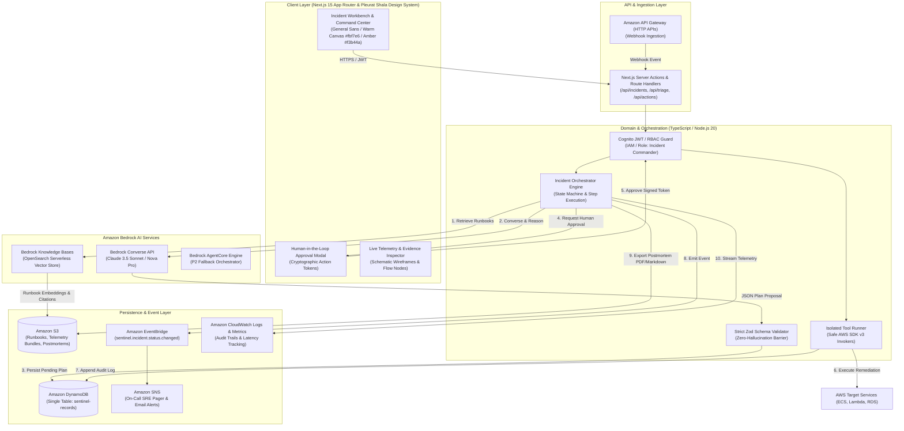
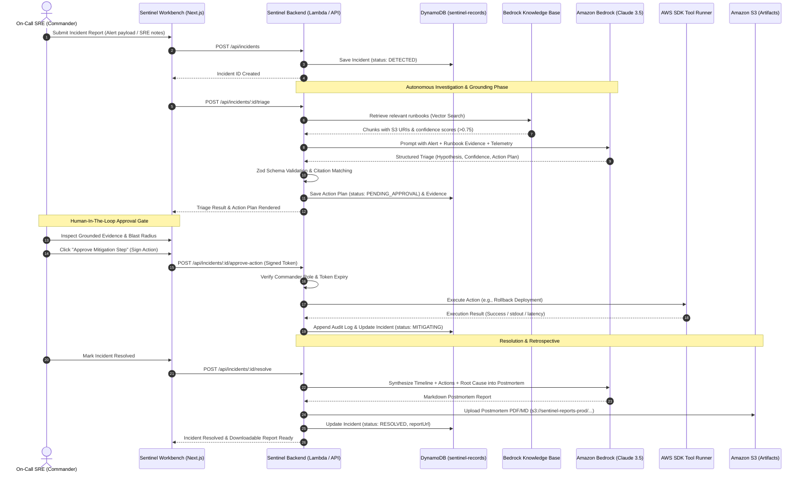

# ARCHITECTURE.md — SENTINEL Platform Architecture

> **SENTINEL: AI Incident Intelligence & Autonomous Response Platform**  
> *Target: AWS Hackathon (3-Day Implementation)*  
> *Design Language: Pleurat Shala Architectural System (`#fbf7e6`, `#f3b44a`, `#16140e`)*

---

## 1. Executive Summary & Problem Statement

Modern cloud outages cost enterprises an average of $9,000/minute. During a critical incident (SEV-1 / SEV-2), on-call Site Reliability Engineers (SREs) face alert fatigue, distributed telemetry sprawl across dozens of CloudWatch dashboards, and fragmented tribal runbooks. 

**SENTINEL** transforms chaotic operational incidents into evidence-grounded, human-in-the-loop autonomous response workflows. Powered by **Amazon Bedrock** (Anthropic Claude 3.5 Sonnet / Amazon Nova Pro) and **Bedrock Knowledge Bases**, SENTINEL:
1. Ingests incident alerts and telemetry snapshots.
2. Performs vector-grounded root-cause analysis against enterprise runbooks and architectural postmortems.
3. Formulates step-by-step mitigation plans with blast-radius analysis.
4. Enforces a strict cryptographic **Human-in-the-Loop (HITL) approval gate** before triggering any mutating remediation action.
5. Produces an automated post-incident retrospective and compliance audit trail in Amazon S3.

---

## 2. High-Level Architecture Diagram

---

## 3. Core Subsystems & Domain Boundaries

### 3.1 Frontend Subsystem (`/app`, `/components`)
- **Visual Design System**: Built in accordance with Pleurat Shala specifications:
  - Surface: `#fbf7e6` (muted cream canvas), `#000000` / `#16140e` (dark base/ink text), `#f3b44a` (warm ochre accent), `#efe9d2` (elevated cards).
  - Typography: General Sans / Inter, technical figure markers (`FIG. 001`), breadcrumbs (`■ ■ ■ INCIDENT / WORKBENCH / ACTIVE`).
  - Interactive workbench nodes: SVG wireframe connectors (`C4`, `L3`, `U2`), live status badges, and animated workflow steps.
- **Incident Workbench**: Dual-pane command center. Left: chronological triage timeline, root-cause hypothesis, grounded evidence citations. Right: proposed action plan, blast-radius card, and cryptographic approval drawer.
- **Analytics & SLA View**: Mean Time to Detect (MTTD), Mean Time to Mitigate (MTTM), AI token cost tracking, and tool execution reliability metrics.

### 3.2 AI Orchestration Subsystem (`/backend/ai`, `/lib/aws/bedrock`)
- **Decoupled Engine Design**:
  - `BedrockConverseEngine`: Core P0 production engine using `@aws-sdk/client-bedrock-runtime` with structured JSON output and temperature=0.1.
  - `KnowledgeBaseRetriever`: Queries Bedrock Knowledge Base using `@aws-sdk/client-bedrock-agent-runtime` (`RetrieveCommand`) to extract chunks with source URI and relevance score.
  - `BedrockAgentEngine`: Optional P2 engine utilizing AWS Bedrock Agents.
- **Zero-Hallucination Barrier (`/backend/ai/validators`)**:
  - Raw model outputs are **NEVER** trusted directly.
  - Every payload passes through Zod runtime schema validation.
  - If a generated action references an entity not present in the retrieved evidence or incident telemetry, the validator flags a `GROUNDING_VIOLATION` and falls back to manual triage.

### 3.3 Persistence & Event Subsystem (`/backend/repositories`, `/lib/aws/dynamodb`)
- **Single-Table DynamoDB Schema**:
  - High performance, predictable sub-10ms single-digit read/write latency.
  - Partition Key (`PK`) and Sort Key (`SK`) patterns partitioning Incidents, Timeline Events, Evidence Chunks, Action Plans, and Audit Logs.
  - GSI1 for Status Filtering (`STATUS#OPEN`, `STATUS#INVESTIGATING`, `STATUS#RESOLVED`).
  - GSI2 for Severity-based On-Call queues (`SEV1`, `SEV2`, etc.).

### 3.4 Tool Execution & Security Guardrails (`/backend/tools`, `/backend/domain/security`)
- **Role-Based Execution Guard**:
  - Non-mutating tools (e.g., `inspect_cloudwatch_logs`, `query_ecs_service_health`) execute automatically during triage.
  - Mutating tools (e.g., `restart_ecs_task`, `rollback_lambda_alias`, `scale_auto_scaling_group`) require an explicit cryptographic approval payload containing:
    - `incidentId`
    - `planId`
    - `actionId`
    - `approverEmail`
    - `nonce` & `timestamp` (<5 minute expiry)
  - Execution runs through deterministic AWS SDK wrappers with dry-run verification and automatic rollback capture.

---

## 4. Architectural Sequence Flow

---

## 5. Technology Stack & AWS Services Rationale

| Service / Tool | Purpose in Sentinel | Visible Hackathon Demonstration |
| :--- | :--- | :--- |
| **Amazon Bedrock** (`anthropic.claude-3-5-sonnet-20241022-v2:0` / `amazon.nova-pro-v1:0`) | Core reasoning, incident diagnosis, structured action plan generation, and postmortem synthesis. | Real prompt-to-response generation with streaming status, confidence metrics, and deterministic structured JSON. |
| **Bedrock Knowledge Bases** (OpenSearch Serverless) | RAG over engineering runbooks, architecture decision records (ADRs), and past postmortems. | Clickable evidence drawer showing exact runbook passages, confidence scores, and S3 source references. |
| **Amazon DynamoDB** | Single-table persistence for incidents, audit timeline, action plans, and telemetry snapshots. | Real CRUD latency (<10ms), optimistic locking, and query filtering by severity/status. |
| **Amazon S3** | Storage for knowledge runbook markdown files, incident diagnostic bundles, and generated postmortem PDF reports. | Live upload of runbooks and generation of signed S3 download URLs for post-incident reports. |
| **AWS Lambda & API Gateway** | Serverless backend execution for webhooks, triage triggers, and tool runner. | Fast serverless execution and direct AWS IAM role containment. |
| **Amazon EventBridge & SNS** | Event-driven status dispatch and real-time SRE alerting. | Event emission on incident severity changes and live SNS email/SMS alert dispatch. |
| **Amazon CloudWatch** | Structured logging, model invocation latency tracking, and operational metrics. | Live telemetry cards on Sentinel dashboard displaying AWS request IDs and execution traces. |
| **Next.js 15 & Tailwind CSS** | Modern App Router interface implementing the Pleurat Shala design system. | Warm canvas (`#fbf7e6`), schematic diagrams, interactive breadcrumbs, micro-animations, and full WCAG AA accessibility. |
